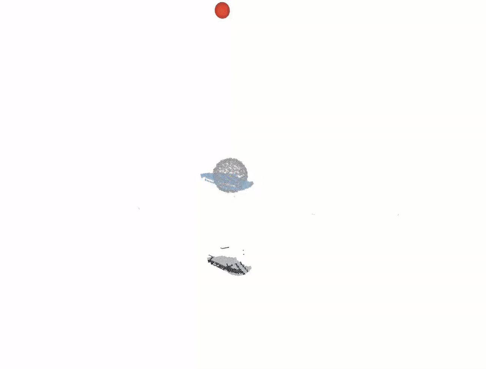

# Kairos

[](https://arxiv.org/abs/2609.27467)
[](https://iacopomc.github.io/kairos/)
[](http://wiki.ros.org/noetic)
[](LICENSE)

This repository is the official implementation of the paper:

> **Kairos: Grounded Forecasting of Presence and Directional Flow in 4D Scene Graphs**
>
> [Iacopo Catalano](https://scholar.google.com/citations?hl=en&user=VnPwRvkAAAAJ&view_op=list_works&sortby=pubdate), [Julio Placed](https://scholar.google.com/citations?hl=en&user=1ho6W5EAAAAJ&view_op=list_works&sortby=pubdate), [Javier Civera](https://scholar.google.com/citations?hl=en&user=j_sMzokAAAAJ&view_op=list_works&sortby=pubdate), and [Jorge Pena-Queralta](https://scholar.google.com/citations?hl=en&user=J1SHJeMAAAAJ&view_op=list_works&sortby=pubdate). <br>
>
> *arXiv preprint arXiv:2609.27467*, 2026

Kairos is a *predictive directional-flow memory* that extends a 3DSG to a 4D scene graph (4DSG).
A spectral predictor on each mixing weight of a per-voxel directional mixture forecasts the entire distribution over time, anchored to the observed voxels of the robot's TSDF reconstruction and kept consistent under map re-optimization.

At any traversable location and any future time, Kairos answers two questions a static map cannot: whether agents are likely to be present there, and if so, how they are likely to be moving, as a full directional distribution. A presence channel kept separate from flow distinguishes *no one passes here* from *no one has yet been observed*. Because the forecast covers the whole reconstructed environment and is exposed on the navigational graph, a robot can weigh entire routes before committing to one, comparing how each will flow at the time it would traverse it rather than planning against a snapshot.

<div align="center">
    
</div>

## Prerequisites

- **Docker**, or **Ubuntu 20.04** with **ROS Noetic** for a native build
- A pedestrian detection source: a tracks CSV per scene for the Python
  pipeline, or `odom_array_msgs/OdometryArray` messages for the ROS node

## Installation

Kairos was developed using Ubuntu 20.04 and ROS 1 Noetic. Docker is the recommended way to use it on any other system. Both start from the same workspace.

### 1. Set up the workspace

```bash
mkdir -p ~/kairos_ws/src && cd ~/kairos_ws/src
git clone https://github.com/IacopomC/kairos.git
vcs import . < kairos/install/kairos.rosinstall   # needs python3-vcstool
```

### 2a. Docker

**Build the image.**

```bash
~/kairos_ws/src/kairos/docker/build_image.sh      # -> kairos:latest
```

**Run Kairos on a scene.**

```bash
docker run --rm -v /path/to/datasets:/data -v /path/to/output:/out kairos \
    kairos run /data/tbd/<month>/<scene> -c tbd -l ade20k_outdoor \
    --tracks /data/tbd/<month>/<scene>/tracks.csv \
    -o /out/run01 --no-publish
```

**What you get** in `/path/to/output/run01/<scene>/`: the scene graph
(`backend/dsg_with_mesh.json`), the trained flow state (`temporal/flow_state.bin`) and
the run's config. `flow_state.bin` is the trained model: pass it to the next
session with `--load-flow-state`, or evaluate it with `--score-tracks`.

### 2b. Native (Ubuntu 20.04 + ROS Noetic)

**System dependencies**: CMake 3.22 or newer, GTSAM 4.1 and pybind11 2.11 or newer:

```bash
sudo apt install -y software-properties-common wget gnupg
wget -qO - https://apt.kitware.com/keys/kitware-archive-latest.asc \
    | gpg --dearmor - | sudo tee /usr/share/keyrings/kitware-archive-keyring.gpg >/dev/null
echo 'deb [signed-by=/usr/share/keyrings/kitware-archive-keyring.gpg] https://apt.kitware.com/ubuntu/ focal main' \
    | sudo tee /etc/apt/sources.list.d/kitware.list
sudo add-apt-repository -y ppa:borglab/gtsam-release-4.1
sudo apt update && sudo apt install -y cmake python3-pip python3-catkin-tools \
    python3-rosdep python3-vcstool python3-tk nlohmann-json3-dev libzmq3-dev \
    libgtsam-dev libgtsam-unstable-dev
pip3 install "pybind11>=2.11"
```

**Serialize the GTSAM solve** in Kimera-RPGO (see the note below):

```bash
cd ~/kairos_ws/src/Kimera-RPGO
sed -i '1i #include <tbb/global_control.h>' src/RobustSolver.cpp
sed -i 's|^\(void RobustSolver::optimize().*{\)|\1\n  tbb::global_control gc(tbb::global_control::max_allowed_parallelism, 1);|' src/RobustSolver.cpp
```

**Build the C++**, from the workspace root:

```bash
cd ~/kairos_ws
source /opt/ros/noetic/setup.bash
sudo rosdep init 2>/dev/null; rosdep update          # once per machine
rosdep install --from-paths src --ignore-src -r -y
catkin config --extend /opt/ros/noetic -DCMAKE_BUILD_TYPE=Release -DBUILD_TESTING=OFF \
    -DCONFIG_UTILS_BUILD_DEMOS=OFF -DCMAKE_POLICY_VERSION_MINIMUM=3.5
catkin build hydra kairos
source devel/setup.bash
```

**Install the Python dependencies:**

```bash
pip install ./src/spark-dsg-kairos
pip install --no-deps imageio networkx scipy tqdm distinctipy click pyqtgraph "numpy==1.24.4"
pip install --no-deps ./src/hydra-kairos
```

**Build the Kairos Python bindings:**

```bash
cmake -S src/kairos/python -B build/kairos_python -DHYDRA_FLOW_DIR=$PWD/src/hydra-kairos \
      -DPYTHON_EXECUTABLE=$(which python3) -DCMAKE_BUILD_TYPE=RelWithDebInfo \
      -DCMAKE_POLICY_VERSION_MINIMUM=3.5
cmake --build build/kairos_python -j
cp build/kairos_python/_kairos_bindings*.so src/kairos/python/src/kairos_python/
```

**Run it.** In every new shell, source the workspace and put `kairos_python` on
the Python path; `python3 -m kairos_python run` takes the same arguments as
`kairos run` in the image:

```bash
source ~/kairos_ws/devel/setup.bash
export PYTHONPATH=~/kairos_ws/src/kairos/python/src:$PYTHONPATH
python3 -m kairos_python run --help
```

The ROS packages build in the same workspace: `catkin build hydra_ros kairos_ros`.

> **GTSAM and TBB.** The packaged GTSAM runs its solve in parallel with TBB and crashes nondeterministically inside `OptimizeClique` when many loop closures accumulate. The patch above makes that solve single-threaded. Re-apply it after a fresh checkout of Kimera-RPGO.

## Running Kairos

```bash
kairos run <scene>... -c <config> -l <labelspace> -o <output-dir>
```

| Option | Meaning |
|---|---|
| `-c, --config-name` | a file in [`config/datasets/`](config/datasets/) without the `.yaml` (e.g. `tbd`, `atc`) |
| `-l, --labelspace` | a file in [`config/label_spaces/`](config/label_spaces/) without the `_label_space.yaml` |
| `-o, --output-path` | where the scene graph, flow state, and config are written |
| `-m, --max-steps` | stop after N frames; useful for a quick test |
| `--tracks` | pedestrian tracks CSV to feed the flow layer, when detections are not produced by the perception stack |
| `--load-flow-state` | resume from a previously trained `flow_state.bin` instead of starting empty (in case of multi-sessions scenes) |
| `--score-tracks` | evaluates a held-out tracks CSV at the end of the run |
| `--enable-lcd/--no-enable-lcd` | loop-closure detection; needs `--bow-vocab` |
| `--publish/--no-publish` | publish over ZMQ; turn off for offline runs |

`kairos run --help` lists the rest.

Each scene runs in its own pipeline and writes to `<output-dir>/<scene name>/`.
A multi-session deployment is reproduced by running the sessions in order, each
with the previous session's `<output-dir>/<scene name>/temporal/flow_state.bin`
as `--load-flow-state`: the 3DSG is rebuilt per session and the flow state
carries over.

**Quick test** (200 frames, no evaluation):

```bash
docker run --rm -v /path/to/datasets:/data -v /path/to/output:/out kairos \
    kairos run /data/tbd/<month>/<scene> -c tbd -l ade20k_outdoor \
    -o /out/smoke -m 200 --no-publish
```

## Grounded simulation

In its *grounded simulation* in [`kairos-suite`](https://github.com/IacopomC/kairos-suite), a simulated robot patrols a navigation graph authored on the dataset's floor map with a bounded field of view, and the detections it sees feed the flow model as a live sensor would. This allows to train Kairos over months of real pedestrian traffic (ATC, Havlíčkův Brod).

## Visualization

We use rerun.io for an interactive, time-scrubbable 3D recording of a run.

**1. Produce a recording (`.npz`).** Set `KAIROS_VIZ_RECORDING=1` on a `kairos run`.

**2. Render it to `.rrd`** with [`kairos_visualizer/`](kairos_visualizer/)
(needs Python 3.9+):

```bash
pip install ./kairos_visualizer
python -m kairos_visualizer run.npz -o run.rrd
```

In alternative, use the docker image:

```bash
docker build -t kairos-viz kairos_visualizer
docker run --rm -v "$PWD":/out kairos-viz /out/run.npz -o /out/run.rrd
```

**3. View it.** The viewer alone needs the `rerun-sdk`:

```bash
pip install rerun-sdk && rerun run.rrd
```

Without Python 3.9 (e.g. on Ubuntu 20.04), use the standalone viewer binary
shipped inside the Linux wheel on
[PyPI](https://pypi.org/project/rerun-sdk/0.34.1/#files): download the
`manylinux` `x86_64` `.whl`, unzip, and run the bundled binary.

```bash
unzip rerun_sdk-0.34.1-*_x86_64.whl -d rerun_pkg
chmod +x rerun_pkg/rerun_sdk/rerun_cli/rerun
./rerun_pkg/rerun_sdk/rerun_cli/rerun run.rrd
```

Small `.rrd` files can also be dragged into app.rerun.io.

## Documentation

| Document | Contents |
|---|---|
| [`doc/pipeline_overview.md`](doc/pipeline_overview.md) | how the flow pipeline fits together, end to end |
| [`doc/temporal_dynamics.md`](doc/temporal_dynamics.md) | the flow model: mixture, spectral forecasting, presence, coupling |
| [`doc/params.md`](doc/params.md) | every configuration parameter |
| [`doc/Concepts.md`](doc/Concepts.md) | vocabulary used across the code |
| [`doc/timing.md`](doc/timing.md) | how the cost measurements are taken |

The C++ headers under `include/kairos/` carry Doxygen comments. For a browsable
HTML reference:

```bash
apt install doxygen graphviz    # graphviz for the diagrams
doxygen Doxyfile
```

Output lands in `doc/api/html/index.html`.

## Citation

If you use this code in your work, please cite:

```
@article{catalano2026kairos,
  title={Kairos: Grounded Forecasting of Presence and Directional Flow in 4D Scene Graphs},
  author={Catalano, Iacopo and Placed, Julio A and Civera, Javier and Pe{\~n}a-Queralta, Jorge},
  journal={arXiv preprint arXiv:2609.27467},
  year={2026}
}
```
